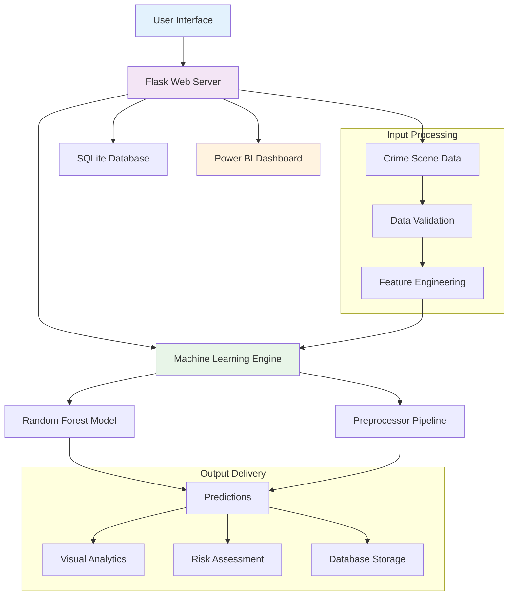

# 🔬 CrimeScope AI: Advanced Crime Prediction System


---


## 🎯 Overview
**CrimeScope AI** is a **production-ready web application** that predicts urban crime patterns using **machine learning**.  
It leverages **Random Forest models** to forecast crime categories and arrest probabilities with **91.6% accuracy**, providing actionable insights to law enforcement.


---

## ✨ Features

<details>
<summary>🎨 Modern User Interface</summary>

- 3D Glass Morphism design with dynamic animations  
- Dark/Light mode toggle  
- Animated radar charts for risk visualization  
- Real-time risk assessment indicators  
- Interactive sample data for testing
</details>

<details>
<summary>🤖 Advanced AI Capabilities</summary>

- Multi-target Random Forest model (91.6% accuracy)  
- Real-time crime category prediction (5 categories)  
- Arrest probability analysis (99.98% accuracy)  
- Automated feature engineering and preprocessing  
- Model persistence via joblib
</details>

<details>
<summary>📊 Data & Analytics</summary>

- SQLite database integration (CRUD operations)  
- Power BI dashboard for interactive analytics  
- Real-time data visualization with filters  
- Historical crime pattern analysis  
- Spatio-temporal trend detection
</details>

<details>
<summary>🔧 Technical Features</summary>

- RESTful API with JSON responses  
- CORS enabled  
- Error handling with user-friendly messages  
- Database migrations support  
- Health monitoring endpoints
</details>

---


## 🏗️ System Architecture


## 🚀 Installation

### Prerequisites
Before installing, make sure you have the following:

- **Python 3.9+**  
- **pip** (Python package manager)  
- **Git**  
- **Modern web browser** (JavaScript enabled)  

### Setup
1. **Clone the repository**
```bash
git clone https://https://github.com/natashafatii/crime-prediction-system
cd crime-prediction-system
# Create virtual environment
python -m venv venv
# Windows
venv\Scripts\activate
# Mac/Linux
# source venv/bin/activate

# Install dependencies
pip install -r requirements.txt
```

---

## 🛠️ Initialize Database

The SQLite database will be automatically created and initialized on the first run.

```bash
python check_db.py
# Automatically creates SQLite DB if not exists
```
## 💻 Usage

### 1. Start Flask Server
```bash
python app.py
```


## 📊 Power BI Dashboard

- Real-time crime heat maps  
- Temporal analysis (hourly/daily/monthly)  
- Crime category distribution  
- Arrest vs no arrest analysis  
- Interactive filters by district, type, and time  

**Access Dashboard directly:**  
[](https://app.powerbi.com/view?r=eyJrIjoiODdiNzkxMjktN2FhMy00OGZkLWI0ZTUtOTI3MmFiMTk2NWNlIiwidCI6IjkwMWQ5YTk5LTI3NTgtNGM5ZS1iNWM3LTI2MWM2OTIwZmQzNyIsImMiOjl9)


---

### 2️⃣ Model Details
Explain ML model specifics, categories, and feature engineering. Example:

## 🤖 Model Details

- **Algorithm:** Random Forest (multi-target)
- **Accuracy:** 91.64%
- **Arrest Prediction Accuracy:** 99.98%
- **Feature Engineering:** Temporal & location encoding
- **Serialization:** Joblib

### Crime Categories

| Code | Category        | Risk       |
|------|----------------|-----------|
| 0    | Drug Crime      | Medium    |
| 1    | Other Crime     | Low       |
| 2    | Property Crime  | Medium    |
| 3    | Sex Crime       | High      |
| 4    | Violent Crime   | Critical  |


## 🛠️ Technology Stack

- **Backend:** Python 3.9, Flask, Scikit-learn, Pandas, NumPy, Joblib  
- **Frontend:** HTML5, CSS3, JavaScript ES6  
- **Database:** SQLite  
- **Visualization:** Power BI
## 🔮 Future Enhancements

- Real-time data feeds  
- User authentication  
- Cloud deployment (AWS/Azure)  
- Mobile app interface  
- Neural network models
